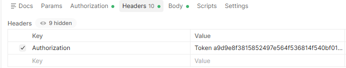
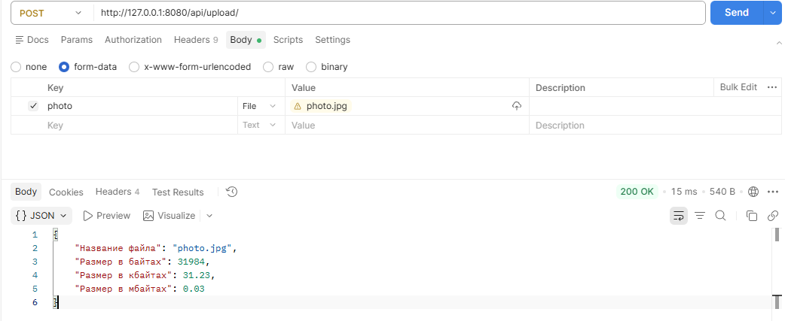

# Отчет по выполненному заданию. 
## Django API

# Для проверки работоспособности API используется Postman.

Перед выполнением надо авторизоваться в браузере по адрессу: http://127.0.0.1:8000/admin
После чего: F12 -> Application -> Cookies -> sessionid (необходимо скопировать)

После чего вставить в Postman: Tools (внизу) -> Cookies -> Add Cookies -> Вставить куки 
 

Для всех использований API проверяется авторизация (кроме метода PUT (изменение объявления (название, описание,
статус)) - по той причине, что в создании объявления выбирается кастомный пользователь, а войти под его данными на данный момент невозможно). 

Запрос выполняется по адрессу: http://127.0.0.1:8000/путь_апи_в_названии_задания
Ответом  будет JSON совместно со статусом HTTP 200 - что означает грамотность выполнения запроса. 

**Также задание было выполнено на Django Rest Framework (DRF). Для проверки задания DRF необходимо в строке запроса изменить v1 на v2**

## Задание 1. GET /api/v1/trades/ - список объявлений (id, title, дата создания) - только открытые:

В Postman необходимо выбрать метод GET и перейти по необходимому адресу

## Задание 2. POST /api/v1/trades/ - создание объявления:

Для проверки в Postman необходимо выбрать режим POST, после чего в Body выбрать raw и написать JSON в формате:
[
    {
        "title": "Пример нового объявления",
        "text": "Пример описания объвления",
        "status": 1 //Задаем статус под id=1 "Новый"
    }
]

HTTP 201 - соответствует тому, что запись получилось сделать.

## Задание 3. GET /api/v1/trades/ID/ - получение всех полей объявления и ссылок на изображения

Для того чтобы проверить, работает ли данный API, необходимо выбрать GET, вместо ID указать id объявления для которого нужно вывести изображения. 

Ответом является JSON с данными объявления и ссылками на изображения. HTTP 200 соответсвует правильному выполнению.

## Задание 4. PUT /api/v1/trades/ID/ - изменение объявления (название, описание, статус):

Для проверки в Postman необходимо выбрать режим POST, после чего в Body выбрать raw и написать JSON в формате:
[
    {
        "title": "Пример обновленного объявления",
        "text": "Пример обновленного описания объвления",
        "status": 1 "
    }
]

HTTP 201 - соответствует тому, что запись получилось изменить.

## Задание 5. POST /api/v1/trades/ID/images/ - добавление изображения объявления:

Для выполнения данного задания в Postman необходимо выбрать метод POST, в Body выбрать form-data, key назвать image и прикрепить необходимый файл. 

В адрессной строке вместо ID пишем id нужного объявления.

В ответ получаем JSON ответ с измененным объявлением и новым изображением. HTTP 200 соответсвует правильному выполнению.

## Задание 6. DELETE /api/v1/trades/ID/images/ID/ - удаление изображения объявления.

В адрессной строке первым ID выбираем id объявления, вторым ID выбираем id изображения. После чего в Postman выбиарем метод DELETE. 

После чего получаем JSON ответ с объявлением где было удалено изображение. HTTP 200 соответсвует правильному выполнению.

### результат валидации тоже в JSON + HTTP статус 400:

При не пройденной валидации, не авторизованности пользователя и т.д. ответом является также JsonResponse + HTTP 400, например:

При неверно введеном JSON:

При неправильном заполнении данных:

При выполнеии запроса не авторизованным пользователем:

В консоли это выглядит так:

# Задание на кастомную авторизацию пользователя

### Задание заключается в следующем:

`На базе drf выполни авторизацию пользователя посредством передачи в HTTP заголовке Authorization значений вида «Token ABC», где ABC строка с токеном`

### Выполнение задания:

Я добавил возможность получения api ключа после авторизации. Добавил проверку на авторизацию через токен для API v2 (Воспользоваться API можно и через токен и через сессию)

Для написания запросов с использованием токена необходимо перейти в Postman -> Headers -> Заполнить key как: Authorization -> Заполнить Value в формате Token <Токен>. 

Пример:

После указания токена в голову запроса можно осуществлять все действия с API ключами как сессионно авторизованный пользователь (но только для API v2)

# Задание на ассинхронную загрузку файлов

Задание заключается в следующем: 
`На базе фреймворка aiohttp необходимо разработать API для загрузки
файлов:
POST /api/upload/

Файл нужно принять и в ответ на запрос вернуть JSON содержащую
информацию о файле:
- Размер файла`

Файл нет необходимости сохранятьна диск или полностью читать в память, а проект должен быть сохранен в директорию t2.

### Выполнение задания:

В директории t2 был создан файл main.py в котором с использованием aiohttp был написан API для возврата названия файла, размера в байтах, Кбайтах, Мбайтах. Принцип работы заключается в раздроблении файла на меньшие пакеты и суммировании длинны чанков. На выходе - переменная содежащая размер файла. Это необходимо для того чтобы файл мог быть прочтен не засоряя память.

Для проверки задания необходимо перейти в Postman - > Указать адресс: http://127.0.0.1:8080/api/upload/ -> Body -> form-data -> Ввести произвольное название в Key -> Прикрепить файл размер которого нужно узнать.

Пример:

В итоге возвращается JSON со всеми необходимыми данными